# 12 — How It Works (plain-English operations guide, DOC)

**v1.71, operator-commissioned 2026-07-15.** A complete, non-technical
explanation of everything the bot can do — from composing a trade, arming,
entering the password, through an entry firing, to how every watchdog and
process protects the position — written so a non-technical reader understands
exactly what is happening and why.

## Rules

- **DOC-01 Truth discipline.** This document is part of the hash-locked spec
  and carries the spec version it describes. Prose that drifts from behavior
  is the lying-gate defect in words — so: (1) every future amendment that
  changes operator-visible behavior MUST update the affected chapter in the
  same ratification (changelog-enforced by ritual, like diagram updates);
  (2) the first draft is generated by the agent FROM THE RATIFIED SPEC (never
  from code), verified by the adviser against both spec and code, and ratified
  by the operator before it renders anywhere.

- **DOC-02 Language standard.** Plain English. No rule IDs in the body text
  (chapters may footnote them for cross-reference); no jargon without an
  immediate one-line explanation; every mechanism explained with a concrete
  dollar example at least once (the canonical $4.00-credit trade is the house
  example). The test of every paragraph: a smart reader with zero trading or
  software background can say what the bot will do next and why.

- **DOC-03 Coverage — the chapter list (each REQUIRED, this list is the
  completeness contract):**
  1. What the bot trades and the shape of the trade (iron condor, the tent,
     collected premium, defined risk).
  2. Setting up a day: the schedule card, per-row settings, what Save pins.
  3. The three switches that allow trading (Arm, Confirm Live, Stop Trading)
     and the password — what each protects and what survives a restart.
  4. What happens at entry time, step by step: the 60-second warm-up, the
     gates (every gate named with its plain reason to exist, including the
     calendar blackout), strike selection as a walk, the order ladder, and
     what "protected" means.
  5. The stops: where they live (at the broker, not in the bot), why that
     matters, exactly what triggers them, and the outcome contract in dollars
     (one side hit / both sides hit / nothing hit).
  6. The watchers, one page each in simple terms: the stop watchdog, the
     fill detector, the LEX long-recovery ladder and its floor orders, the
     decay buyback, the take-profit floor and target, the day-end order
     audit, the settlement capture, the reconciler, and the wiring audit —
     each answering: what it watches, when it acts, what it will never do.
  7. Manual controls: fire-now with strike floors, Close, Flatten, the
     outage drill — and the bot's one absolute promise: it never overrides
     an action you take directly at the broker.
  8. When things go wrong: what an UNPROTECTED alert means, what a
     correction on the dashboard means, what standing down means, and what
     the bot does when it restarts mid-day.
  9. The dashboard: what broker-confirmed / bot-computed / broker-imported
     badges mean, and why a number is never silently corrected.
  10. The calendar: event days, tags, and how a no-trade day behaves.

- **DOC-04 Flowchart.** One master flowchart (mermaid, UI-26 contrast rules)
  spanning compose → arm → password → warm-up → gates → selection → order →
  protected → monitored → exit paths → settlement → report, with each watcher
  as an annotated branch. Rendered alongside the prose; every node uses the
  chapter vocabulary, not rule IDs.

- **DOC-05 Rendering (UI-29).** A separate client-side route in the existing
  SPA, rendered from this document (single source), stamped "describes spec
  vX.YY" — if the running build's spec version differs from the stamped one,
  the page banners the mismatch instead of pretending currency.

---

# THE GUIDE (ratified content, v1.72 — describes spec v1.72; DOC-05 stamp)

## The master flowchart

The full trading day, from boot through the next day self-starting. Every
node uses plain-English chapter vocabulary, not rule IDs, per DOC-04; the
gates that matter most for correctness — the market-halt check and the
calendar blackout check — are called out explicitly, including that they
lean in *opposite* directions on purpose (see Chapters 4 and 10 for why).

```mermaid
flowchart TD
    Boot["Bot starts or restarts"] --> Restore["Everything remembered restores exactly:\narmed/disarmed, Stop Trading, Confirm Live,\npaper or live, the standing schedule,\nany profit floors/targets, calendar tags, full history"]
    Restore --> Recon["Check the account against\nwhat the bot remembers"]
    Recon --> Foreign{"Any position the bot\ndoesn't recognize?"}
    Foreign -->|yes| Quarantine["Leave it alone, flag it,\nnever touch it"]
    Foreign -->|no| Dash["Operator opens the dashboard"]
    Quarantine --> Dash

    Dash --> ArmedCheck{"Already armed?"}
    ArmedCheck -->|no| Compose["Compose the day: how many trades,\nwhat time each fires, size, target premium,\nwing width, stop settings, any profit\nfloor or target"]
    Compose --> ArmPress["Press Arm"]
    ArmPress --> Preflight{"Pre-flight passes?\nclock in sync, broker session valid,\ndata flowing, at least one\ntrade composed"}
    Preflight -->|fails| Compose
    Preflight -->|passes| Access["Panel unlocked with the\nuser password (Ch. 3)"]
    Access --> Armed["ARMED — waiting.\nAll three switches (Armed,\nConfirm Live on, Stop Trading off)\nmust read GO for anything to fire"]
    ArmedCheck -->|yes| Armed

    Armed --> Warmup["60 seconds before each scheduled time:\nrefresh the login, confirm fills are being\nheard, confirm the option chain is ticking"]
    Warmup --> Fire["The scheduled time arrives"]

    Fire --> GateSwitch{"Armed, Confirm Live on,\nStop Trading off, no Flatten\nrunning, still within the timing window?"}
    GateSwitch -->|no| Skip["Entry SKIPPED\nplain-language reason shown"]
    GateSwitch -->|yes| GateMarket{"Market open and CONFIRMED not halted\n(silence here means BLOCKED)?\nAND today not tagged no-trade\n(silence here means TRADE — a tag\nneeds an acknowledged override to fire manually)?"}
    GateMarket -->|no| Skip
    GateMarket -->|yes| GateAccount{"Price data fresh, broker session good,\nenough buying power, under the daily\norder-count cap, under the day's risk ceiling?"}
    GateAccount -->|no| Skip
    GateAccount -->|yes| Select["Pick strikes: walk out from the\ntarget premium until a strike matches;\nnever above the cap"]

    Select --> ChainCheck{"Enough of the reachable\nchain actually quoted?"}
    ChainCheck -->|retry, still no| Skip
    ChainCheck -->|yes| Collide{"Chosen strike collides\nwith an existing position?"}
    Collide -->|shift, then still blocked| Skip
    Collide -->|clear| Credit{"Enough premium on both sides\nand overall, and is a stop even\npossible on this trade?"}
    Credit -->|no| Skip
    Credit -->|yes| Order["Submit all four legs as ONE order,\nstart at the midpoint,\nwalk the price down every few seconds"]

    Order --> FilledQ{"Filled before the floor price\nor the window runs out?"}
    FilledQ -->|no| Skip
    FilledQ -->|yes| Stops["Place both protective stops\nat the broker, same instant as the fill"]
    Stops --> ConfQ{"Both stops confirmed\nworking at the broker?"}
    ConfQ -->|no, retries exhausted| Unprot["UNPROTECTED — close that\nside down, critical alert"]
    ConfQ -->|yes| Prot["PROTECTED —\nlive, both stops resting at the broker,\nindependent of the bot"]

    Skip --> More{"More scheduled entries\nleft today?"}
    Unprot --> More
    Prot --> More
    More -->|yes| Warmup
    More -->|no more| Monitor["Every open trade is now watched\nfor the rest of the day"]

    Monitor --> Watch1["Stop watchdog double-checks\nthe broker's own trigger"]
    Monitor --> Watch2["Fill detector wakes the instant\na stop fills"]
    Monitor --> Watch3["Long-recovery ladder sells the\nsurviving long, or rests a floor\norder if there's truly no buyer"]
    Monitor --> Watch4["Decay buyback locks in a near-dead\nshort early; long left to expire free"]
    Monitor --> Watch5["Take-profit floor / target close\nthe trade on the operator's own terms"]

    Watch2 --> LexDone["Side fully closed"]
    Watch3 --> LexDone
    Watch4 --> DecayDone["Side closed, long left to expire"]
    Watch5 --> Canon["THE ONE CLOSING ROUTINE:\nreplace each stop with a market exit\n(never naked, never doubled),\nthen sell any remaining long"]
    LexDone --> Report
    DecayDone --> Report

    Monitor --> ManualExit["Operator clicks Close, Flatten,\nor Stop Trading & Flatten"]
    ManualExit --> Canon
    Canon --> Report

    Monitor --> Direct["Operator acts directly\nat the broker"]
    Direct --> Standdown["Bot stands down on that side:\nnever re-places, resizes, or guesses —\nalerts instead with one-click choices"]
    Standdown --> Report

    Monitor --> HeldClose["Held untouched to the close"]
    HeldClose --> Settle["Cash-settle against the market's own\nclosing value; wait for the broker's\nown settlement record before calling\nit final"]
    Settle --> Audit["Day-end order audit: confirm\nnothing is left resting at the broker"]
    Audit --> Report["Day report,\nplus a broker double-check\nthe next morning"]

    Report --> NextDay{"Still armed?"}
    NextDay -->|yes| SelfInit["Next trading day starts itself:\nsame schedule, same checks,\nno operator action"]
    SelfInit --> Warmup
    NextDay -->|no| Idle["Waits, disarmed,\nuntil re-armed"]

    style Prot fill:#c8e6c9,color:#000000
    style Unprot fill:#ffcdd2,color:#000000
    style Skip fill:#ffe0b2,color:#000000
    style Quarantine fill:#ffe0b2,color:#000000
    style Standdown fill:#ffe0b2,color:#000000
    style Report fill:#bbdefb,color:#000000
```

---

## 1. What the bot trades, and the shape of the trade

The bot trades a single options structure called an **iron condor**, built
fresh each day out of SPX index options that expire the same day they're
traded ("0DTE" — zero days to expiry). Every entry has exactly four legs, all
on the same expiration: a short put, a long put further out that protects it,
a short call, and a long call further out that protects it (STK-01). "Short"
means the bot sells that option and collects money for it up front; "long"
means the bot buys an option, paying money, as insurance for the short beside
it. Selling a short with no protection behind it risks a loss with no ceiling
if the market moves far enough; buying the protective long caps how much can
ever be lost on that side, at the cost of a little of the money collected.

This shape — money collected up front, flat across the middle, sloping off to
a hard-capped loss at the edges — is nicknamed **"the tent"**: if SPX finishes
the day between the two short strikes, the bot keeps everything it collected;
the further outside that range SPX finishes, the more of the collected money
it gives back, until the loss maxes out at the width of the wings (the
distance from a short strike out to its protective long) minus what was
collected in the first place (STK-01, STK-03). A wing is `wing_width` points
wide, 50 points by default and set per entry by the operator (STK-03).

The bot does not pick strikes by aiming at a target *net* credit. It aims
each **short** strike at a target price and walks outward until it finds a
matching strike, then places that side's protective long automatically at
the configured wing width beyond it (STK-02). Because the cost of the
protective long moves on its own, the money actually kept after the wing (the
**net credit**) is a different number from the short-leg target, and it
drifts through the day as wing prices move. The dashboard always shows both
figures side by side — "short premium" and "net credit" — rather than
blending them into one ambiguous word "credit" (STK-02a, UI-14).

**House example**, used throughout this guide (the ratified $4.00-credit
trade): short put fills at $3.00 with its protective long put at $0.50; short
call fills at $2.00 with its protective long call at $0.50. Net credit =
(3.00 − 0.50) + (2.00 − 0.50) = **$4.00**, or $400 booked the instant the
trade fills (one contract, ×100). If SPX finishes the day between the two
short strikes, the bot keeps the full $400. If it doesn't, the loss is
bounded by the wing width minus what was collected — and, thanks to the
stop-loss and long-recovery mechanics in Chapters 5 and 6, usually far less
than that maximum.

One honest caveat that applies to **every** dollar figure in this guide:
they are all quoted **before commissions and fees**. Trading index options
costs money on every leg — typically a few dollars for a complete condor's
round trip, per contract set — and the bot deducts those per-contract costs,
taken from a configured fee schedule, in every profit-and-loss figure it
computes (PNL-01). Whatever the bot computes during the day, the day's
final, permanent numbers always come from the broker's own ledger, which
wins every dispute (PNL-04). Chapter 9 covers how that evening check works.

Each scheduled entry trades its own number of contracts, set row by row when
the day is composed — one row might trade 2 condors, another 1 — so the
bot's total exposure for the day is the sum of what every entry, on its own,
could lose in the worst case (ENT-04, RSK-04).

## 2. Setting up a day

The operator builds the day's trading plan on a schedule card before anything
trades. Nothing fires by default: a fresh install ships with zero scheduled
entries, and arming an empty schedule is rejected outright (ENT-01).

Each row on the schedule is one entry attempt: a time of day, written in
24-hour ET (e.g. "11:30"), which must fall between 9:30 am and 4:00 pm and
leave enough runway before an early-close day's 1 pm close to actually work
(DAY-06, DAY-02) — plus that row's own settings: how many contracts, the
short-premium target, the wing width, which stop-math option to use, the stop
percentage, any dollar markup on the stop trigger, and, optionally, a
take-profit floor or target (Chapter 6 covers those).

The strategy page's global settings are only the starting point a brand-new
row is pre-filled with — they are not remote controls over rows that already
exist. The moment a row is saved, every value on it becomes that row's own
concrete instruction, permanently, until someone edits that specific row
again; changing a global setting afterward never reaches back and silently
changes an already-saved row ("pin at Save"). Every saved row also receives a
permanent ID at that moment, and everything downstream that needs to
remember which entry is which — whether it already fired today, its share of
the day's risk, its profit floor — tracks that permanent ID, never the row's
position in the list, so reordering, inserting, or deleting rows around it
can never make an entry silently fire twice or vanish.

Rows remain editable right up until the moment each one fires, even while the
day is already armed and the schedule is live.

## 3. The three switches that allow trading, and the password

Nothing can ever fire unless three independent switches are simultaneously in
the "go" position (ENT-01a, ENT-01b, RSK-01):

- **Armed / Disarmed** — whether the standing schedule is live at all. Arming
  is a deliberate act (at least one row must be composed, and a pre-flight
  check must pass), and once armed it **stays armed indefinitely** — across
  trading days, across restarts, across the machine rebooting — until the
  operator disarms it. Disarming stops future entries only; it never touches
  a position that's already open.
- **Confirm Live** — a second, separate, deliberate toggle that must also be
  on. It exists purely as one more layer of intent between "the software
  could trade" and "the software will trade," and it is required in both
  paper (practice) and live (real money) mode, so exactly the same gate is
  exercised every day regardless of the stakes.
- **Stop Trading** — the mirror image of the other two: if this is on, no new
  entry can fire, no matter what else is true. It blocks new entries only —
  it never closes a position, never touches a resting stop, and never pauses
  a long-sale ladder already in progress.

All three are remembered exactly as left, forever, across every restart — a
machine reboot never quietly re-arms a disarmed bot, and never quietly
re-enables Confirm Live either (REC-07).

**The password.** Before the panel will accept any command that changes
anything — arming, saving a schedule, firing, closing — it must be unlocked
with the operator's password. The live system will not even start without one
configured: there is no such thing as a password-less live panel, whether or
not it's reachable from another machine (NFR-06a). The panel shows plainly
whether it is currently Locked or Unlocked, and checks the password with
clear yes/no feedback rather than silently failing. The password is part of
the machine's configuration, so it survives restarts exactly like the three
switches; it protects *who can operate the panel at all* — it is not an extra
ritual inside each arm. And separately, deeper than the password: pointing
this software at real money requires two deliberate, independent switches to
be thrown in its configuration — flipping one setting alone is refused with
an explanation, so no single mistake can ever aim it at a live account
(NFR-06a).

## 4. What happens at entry time, step by step

Sixty seconds before a scheduled entry, the bot quietly does its homework so
the entry itself is never spent on chores: it confirms its broker login is
still valid (renewing it if not), confirms the connection that reports fills
is alive, and confirms the live options-chain feed is actually ticking
(ENT-08). None of this delays the entry — if anything is still unresolved
when the clock strikes, the entry proceeds straight to its real gate check
regardless.

When the scheduled time arrives, the bot runs its full checklist in order and
skips the entry — showing the exact reason on its card in plain words — the
instant anything fails (ENT-03):

- All three switches from Chapter 3 must read "go," and no all-day Flatten
  action may be in progress.
- The attempt must begin within its two-minute window of the scheduled time —
  if the bot was down or busy past that, the entry is skipped for good; it is
  never fired late, however good the reason (ENT-02). A missed entry isn't
  owed to the schedule later — it's simply gone.
- The market must be open, **confirmed** not halted, and today must not carry
  a no-trade tag. These two checks deliberately lean in opposite directions:
  the halt check **fails closed** — if the bot cannot positively confirm the
  market is open and trading normally, that counts as blocked, exactly like a
  real halt (DAT-04a). The calendar blackout check **fails open** — an empty
  or never-imported calendar blocks nothing, because the calendar is an
  operator-added convenience layered on top of a bot that traded correctly
  before it existed (CAL-05, CAL-07). If today is tagged no-trade (say, an
  FOMC day), a scheduled entry skips with that label shown; a manually fired
  entry is not silently blocked by a tag — the operator must see a blackout
  warning and explicitly acknowledge it first (CAL-06).
- Price data must be fresh, the broker session healthy, buying power
  sufficient, the day's running order count still under its ceiling, and the
  day's total possible loss — including this new trade — still under the
  ceiling the operator set.

Once every gate passes, the bot chooses the actual strikes as a **walk**, not
a formula: starting from the short leg's target price, it checks the exact
target first, then a nickel below, then a nickel above, then further below —
alternating — before settling into stepping down only, looking for the
nearest strike that rounds to each checkpoint in turn. It will settle at most a small step above the target — fifteen cents over, never more, and only after preferring below — and it never goes below
a hard floor (roughly a dollar and a quarter under target, or the configured
minimum, whichever protects more) (STK-02). Before trusting any of this, the
bot checks that enough of the strikes it could realistically reach are
actually quoted with real prices — a listed-but-dead strike is caught here,
rather than causing a wrong pick later (STK-10). If a chosen strike is
already occupied by an opposite-type position (say, a long sitting where the
bot wants to sell a short), it shifts one strike further out and tries again,
up to a small number of times, before giving up on the whole entry (STK-09).

Once strikes are set, all four legs go to the broker as a **single order** —
never as separate pieces, because a condor is meant to open whole or not at
all (ORD-01). It starts priced at the market's own midpoint and, if unfilled,
walks its price down every 20 seconds, retrying a handful of times, but never
below the floor that guarantees a minimum acceptable total credit; if it
still hasn't filled, it's cancelled and the entry is skipped (ORD-02, ORD-03).

The moment all four legs fill, the trade becomes **protected**: in that same
instant, the bot places two independent stop orders directly at the broker,
one per short leg, sized to match exactly what filled (STP-01). "Protected"
specifically means those two stops are **confirmed by the broker** as live
working orders — not merely sent, but acknowledged. If confirmation doesn't
arrive within a bounded number of retries, the position is never left
hanging: that side (or the whole trade) is closed down instead, and a
critical alert fires (STP-04). Chapter 5 covers exactly what those stops do.

## 5. The stops

The single most important design decision in this bot: the two stop orders
on the short legs live **at the broker**, not inside the bot's own software
(STP-01, STP-05). That means the position stays protected even if the bot
crashes, the internet drops, or the machine running it loses power — the stop
is the broker's own working order, sitting on the exchange, ready to fire
regardless of whether the bot is alive to watch it. The long legs never carry
a stop of their own; they are protection for the shorts, not positions to be
stopped out in their own right (STP-06). The trigger itself is checked and
executed by the broker using a **stop-market** order: once the trigger price
is touched, the broker fires a market order to close it immediately at
whatever price it can get, rather than a price-limited order that could
simply fail to fill in a fast move and leave the short naked with nobody
watching (STP-03).

By default, the trigger price is set once, at 95% of the **entire trade's**
net credit — the same number for both the put stop and the call stop
(STP-02). Using the house example from Chapter 1 ($4.00 net credit), both
stops sit at 95% × $4.00 = **$3.80**. That single choice buys a specific,
deliberate outcome:

- **Nothing hit:** a quiet day where neither stop is touched — the bot keeps
  the full $400.
- **One side hit:** the bot pays $3.80 to close the stopped side, having
  banked $4.00 for the whole trade — a guaranteed minimum profit of $20
  **before costs** (commissions and fees, Chapter 1's caveat), and before
  counting whatever the stopped side's protective long sells for on its way
  out (Chapter 6). A one-sided stop-out can never, by this math, turn into a
  loss on the options themselves.
- **Both sides hit** (a "whipsaw" — not an error, a normal and expected
  outcome for this strategy): the bot pays $3.80 twice against the $4.00
  banked, for a loss of about **$360**, before the long-leg recoveries reduce
  it further and before any slippage from the market running past the
  trigger before the stop order actually executes.
- A vanishingly thin trade, where this math would put the trigger **below**
  what the short leg actually sold for, is never opened at all — a trigger
  under the fill price wouldn't be a stop-loss, it would be an instant loss
  the moment the trade opened, so the bot refuses that entry outright before
  it ever executes (STP-02c).

An operator can add a small dollar markup to the trigger to pre-credit some of
the expected long-leg recovery, and can switch the trigger math to be based
on each leg's own price instead of the whole trade's total — but the
95%-of-total-credit default above is what produces the clean "small win /
bounded loss / never worse" outcome contract described here (STP-02, STP-02b).

## 6. The watchers

Once a trade is protected, a set of independent background processes take
over managing it for the rest of the day. Each is described here the same
way: what it watches, when it acts, and what it will never do.

**The stop watchdog.** *Watches:* the live market price of every short leg
that still carries a resting stop. *Acts:* if the price sits at or past the
trigger for ten seconds with the broker's own stop still unfired, it raises a
critical alert; if another ten seconds pass with still nothing, it places its
own market order to close the leg and cancels the resting stop (STP-03b).
*Never:* it does not replace the broker's stop as the primary defense — it is
purely a backup for the case where the broker's own trigger turns out slower
than expected, and it never fires ahead of a confirmed broker fill on the
same leg.

**The fill detector.** *Watches:* the broker's live stream of order events,
for the moment a stop actually fills. *Acts:* the instant it sees a fill (or,
if that stream is briefly down, on its own regular fallback check) it wakes
exactly one decision process, which reads the broker's own truth and starts
selling that side's surviving long immediately (STP-08a). *Never:* it never
re-processes a side that's already finished, and it never sells a long a
second time — a sold long stays sold.

**The long-recovery ladder, and its floor orders.** *Watches:* the market
price of a stopped side's surviving long leg. *Acts:* it sells that long
starting at the market midpoint, walking the price down toward the buyer's
price every fifteen seconds if unfilled, for a bounded number of steps,
before falling back to a price aggressive enough to guarantee a fill
(LEX-01 through LEX-06). Every stopped-out long is **always** sold — there is
no "too cheap to bother" threshold, because a residual long is still risk
sitting on the book (LEX-07). If there is truly no buyer at any price and no
way to price the leg at all, it rests a single minimal order (an "intrinsic
floor" order) and raises a one-time critical alert rather than inventing a
price out of nothing (EC-LEX-08). *Never:* it never sells below what the
option is actually worth (the higher of the current buyer's price or the
option's guaranteed payout value), and it never gives up — if nothing sells,
it keeps trying until expiry.

**The decay buyback.** *Watches:* the asking price of every still-open short
leg. *Acts:* once a short's own asking price has sat at five cents or less
for two checks in a row, sometime before 3:55 pm, the bot cancels its stop
and buys the short back at that near-zero price — locking in the win early
and freeing buying power, rather than holding a near-worthless short all the
way to expiry where a late spike could still stop it out (DCY-01, DCY-02).
The far-out protective long on that side is then simply left to expire — it's
already so deep out of the money it's essentially a free hedge (DCY-03).
*Never:* it never runs outside trading hours, never touches a manually-managed
or suspended trade, and if its own attempt to re-arm the stop ever fails once
while Stop Trading is active, it stops trying for the rest of that period
rather than keep fumbling with protection machinery that's already
misbehaving.

**The take-profit floor and target.** Two separate, operator-armed,
opposite-facing exits — the bot itself never sets either one on its own
(STP-09). The **floor** (TPF) closes a trade if its running profit ever falls
back down to a level the operator chose, locking in a gain instead of
watching it erode: on the house $4.00-credit trade, a 20% floor closes the
position the moment its running profit falls to $0.80 or less, so it never
gives back more than that (TPF-01). The **target** (TPT) closes a trade once
profit rises up to a level the operator chose: on the same trade, arming a
60% target means the trade closes once it could be closed for a debit of
$1.60 or less — locking in at least $240 of the $400 collected (TPT-01,
TPT-06). Both are evaluated by the bot watching live prices, not resting as
orders at the broker — which the dashboard must say plainly, because unlike
the stop-loss, if the bot itself isn't running, neither one can fire (TPF-03,
TPT-04). The moment any short actually stops out, that trade's target
disarms permanently — the target exists for the plan going as intended, not
for a trade that has already had part of it forced out (TPT-05).

**The day-end order audit.** *Watches:* every order the bot has placed that
day. *Acts:* at day's end, it confirms every one is accounted for — genuinely
done, or actively cancelled — before the day is allowed to close; anything it
can't cancel raises a critical alert naming it specifically (EOD-03).
*Never:* it never lets the day quietly end with something still resting,
unaccounted for, at the broker.

**The settlement capture.** *Watches:* the broker's own settlement records
for anything ridden to expiry. *Acts:* it waits for the broker to actually
report the cash settlement for an expiring position before treating that
position's profit-and-loss as final — the bot's own estimate is kept only as
a cross-check (EOD-01). *Never:* it never guesses a settlement value or lets
its own estimate stand in as the record once the real one is available.

**The reconciler.** *Watches:* the gap between what the bot's own records say
and what the broker's account actually shows, every time the bot starts up or
reconnects. *Acts:* broker reality always wins for what positions and fills
actually exist; if the two disagree in any way that matters, it blocks new
trades until the mismatch is explained, and it treats a position it doesn't
recognize as the operator's own — never touching it, never guessing at it
(REC-02, OWN-01 through OWN-03). *Never:* it never silently adopts a
difference without logging it, and never resolves a discrepancy in the bot's
own favor.

**The wiring audit.** *Watches:* nothing in the market — it inspects the
bot's own running program, at startup, to confirm every watcher above is
actually built in and actually ticking, not merely written and forgotten
(NFR-07). *Acts:* it fails the whole build if a required watcher is missing
from the running program, or if a safety check is wired to something that can
never actually say no. *Never:* it never lets a component exist in the spec,
sit fully coded, and quietly never run.

One honest note that belongs here rather than being softened elsewhere: if
the operator disposes of one of the bot's long legs directly at the broker
(outside the bot entirely), the bot's own watchers can still occasionally
raise a false alarm expecting to sell a long that's already gone. That is
left in **on purpose** — suppressing it would mean trusting exactly the kind
of explanation that once let a real failure go unnoticed for days (OWN-12).

## 7. Manual controls

**Fire now, with strike floors.** The operator can fire an entry on demand at
any moment, outside the schedule — a fresh decision, not a stale scheduled
one, so it skips only the two-minute-late rule; every other gate from
Chapter 4 still applies in full (ENT-09). Before it fires, an OK dialog shows
exactly what will be traded and its estimated worst case. Optionally, the
operator can set a floor per side first — "don't sell a put short closer than
this strike" — which never overrides the credit rules, only narrows where
the walk is allowed to look; if the market has already moved past a chosen
floor by the time OK is pressed, the bot refuses to reinterpret it and asks
the operator to re-pick instead (ENT-09b).

**Close.** Every open trade has a one-click "Close trade" button that fires
immediately, with no confirmation dialog — the trade's live numbers are
already on screen, so a dialog would only cost time at the moment it matters
(UC-14).

**Flatten.** A separate, deliberately harder-to-trigger button that closes
every open trade at once. Because its reach is the whole day's book, it
requires the operator to type the word "FLATTEN" to confirm (UC-15).
Flattening does not, by itself, stop future scheduled entries from firing —
that's a second, explicit choice (a checkbox, or the combined "Stop Trading &
Flatten" button) (RSK-01a, RSK-01b).

**The outage drill.** A supported way to prove, on demand, that the stops
really do live at the broker and not inside the bot: the operator can
deliberately sever the bot's own connections for a short window and watch the
stop orders keep resting, untouched, the whole time (UC-12).

Close, Flatten, and every scheduled or watcher-driven exit all funnel through
the exact same one closing procedure inside the bot, so a manual close and an
automatic one always produce an identical sequence of broker actions
(CLS-01, CLS-02).

**The bot's one absolute promise**, running underneath every control in this
chapter: it never overrides an action the operator takes directly at the
broker. If the operator cancels a stop, closes a position, or reduces one by
hand at the broker itself (not through the bot's own buttons), the bot never
re-places it, never resizes it, and never guesses what was meant — it stands
down on that side and hands the operator a clear alert with one-click choices
instead (OWN-09, OWN-10, OWN-11).

## 8. When things go wrong

An **UNPROTECTED** alert means exactly one thing: a short position exists
without a confirmed, working stop resting at the broker, and the bot has
tried and failed, within a bounded number of retries, to place one. It is
always followed by the bot closing that side down rather than leaving it
exposed, and it always shows as a full-width banner, not a quiet card badge
(STP-04, UI-07).

A **correction on the dashboard** means the broker's own end-of-day records
disagreed with what the bot had calculated for a day, and the dashboard has
rewritten that day's number to match the broker — never silently. Every
correction is its own logged event, showing both the old and new figures side
by side, and raises an alert; the target is always zero of these, and any
repeat correction is treated as a bug to find, never as noise to ignore
(RPT-15).

**Standing down** describes what the bot does the moment it detects the
operator has acted directly at the broker on a position it was managing —
closed it, reduced it, or cancelled its stop. The bot stops managing that
side, marks it plainly (fully closed externally, partially reduced, or
unprotected by operator choice), and takes zero further order actions on it —
every one of these events is written to the log, never left as a passing
alert only, precisely because an unlogged standdown once let a real failure
hide behind a plausible-sounding explanation for days (OWN-09, OWN-10,
OWN-11, OWN-12).

**What the bot does when it restarts mid-day:** it rebuilds its entire
picture of the day from its own saved history, then checks that picture
against what the broker actually shows. Any open position it recognizes gets
its management resumed — a still-missing stop is placed immediately, a
long-sale ladder already in progress picks back up where it left off. A
scheduled entry whose time already passed while the bot was down is not
fired late; it's simply gone for the day, exactly as if the market itself had
skipped it (REC-02, REC-03, REC-04, ENT-02). If the bot was armed before the
restart, it comes back armed — a restart never quietly turns a live,
watching bot inert (ENT-10).

## 9. The dashboard

Every number the dashboard shows for a given day carries one of three
honesty badges, so the operator always knows how much to trust it (UI-25):

- **Broker-confirmed** — the bot's own calculation for that day has been
  checked against the broker's actual records after settlement, and they
  matched to the cent.
- **Bot-computed** — the bot's own calculation, not yet checked against the
  broker (or the check hasn't run yet); still a real, immediate, replayable
  number, just not yet independently confirmed.
- **Broker-imported** — figures pulled straight from the broker's own history
  for a day the bot didn't originally journal itself (a one-time backfill of
  older history). This is broker truth by construction, but it is
  deliberately never labeled "confirmed": confirmation specifically means the
  bot's own math matched the broker's, and there was no bot math run for that
  day to compare against.

**Gross, fees, and net are three different numbers**, and the dashboard shows
them separately rather than blurring them into one: gross is what the trades
themselves made or lost, fees are the commissions and per-contract charges
deducted on every leg from the configured fee schedule, and net — gross minus
fees — is the number that actually reaches the account and the only one that
counts as the result (PNL-01, RPT-02). Every evening after settlement, the
bot checks its own day numbers against the broker's records — every fill,
every fee, every cash movement including settlements — and corrects the day
to the broker's figures if they differ (PNL-04, RPT-15). Until the broker's
own settlement record has actually landed, a day where a position was held to
expiry in the money is labeled **provisional**, not final — the bot's own
settlement estimate is never allowed to stand in for the broker's (EOD-01).

A number is **never silently corrected**. If the broker's own record
disagrees with what the dashboard has been showing, the dashboard rewrites
the figure to match the broker — but it always leaves a visible trail: an
event recording both the old and new value, plus an alert, so a disagreement
is always something the operator can go inspect, never something that simply
changes behind their back (RPT-15).

## 10. The calendar

The calendar is a year-view list of scheduled market-moving events — the
Fed's rate decisions, and the government's inflation, jobs, and growth
releases, imported from official published schedules; Fed-speaker
appearances are shown too, but honestly labeled as a best-effort layer, since
no reliable official machine feed exists for them (CAL-01). The calendar
never invents events for a day it has no data for — it shows "no data
imported" instead of a blank that could be mistaken for "nothing happening"
(CAL-02).

The operator can tag any day "no-trade," with a label (defaulting to the
event's own name, like "FOMC"), and can also set a standing rule such as
"always block FOMC days," which auto-tags every current and future FOMC day
without the operator having to remember to do it by hand each time
(CAL-03, CAL-04). Every tag and every standing rule survives every restart,
exactly as set (CAL-03, CAL-04, REC-07).

**How a no-trade day behaves:** it blocks that day's **scheduled** entries
only — a tagged day skips each scheduled entry with a plain reason
("blackout: FOMC") shown on the card and in the day's report. It touches
nothing else: open positions, resting stops, the long-recovery ladder, the
profit floor and target, the decay watcher, day-end settlement — all keep
running exactly as they would on any other day. A blackout is "no new trades
today," never "do nothing to what's already open" (CAL-05). A manual fire on
a tagged day is not silently blocked either, since firing manually is itself
a fresh, deliberate decision — the operator instead sees a clear blackout
warning and must actively acknowledge it before the trade goes through, and
that override is recorded (CAL-06).

One asymmetry is worth stating plainly, since the two calendars in this bot
lean in opposite directions: an empty or never-updated market-events
calendar blocks nothing — the bot traded correctly before this feature
existed, and the calendar is an operator-added convenience layered on top, so
silence from it means "trade normally." That is the deliberate opposite of
the halt check in Chapter 4, where silence or missing data means "assume the
worst and block" (CAL-07; contrast with DAT-04a).

---
